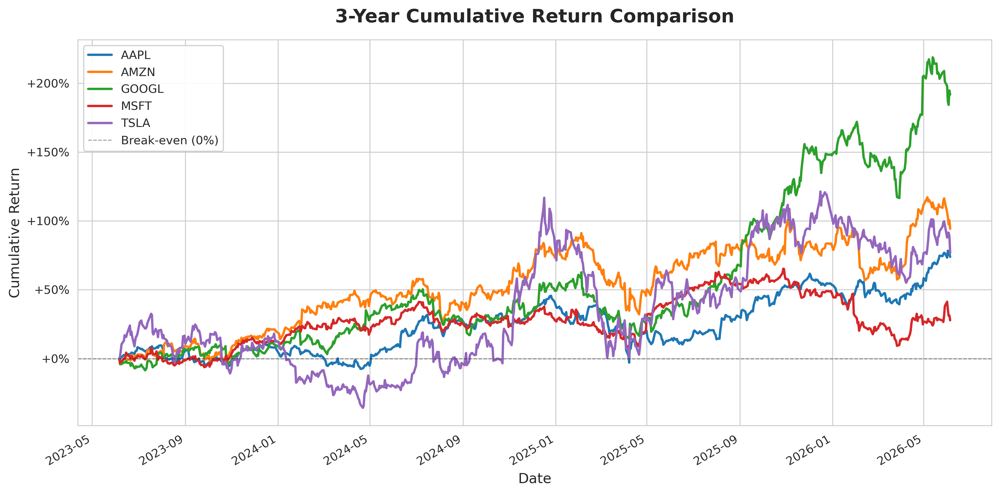

# Automated Financial Performance Tracker

A Python-based tool that automates equity performance analysis across 
any set of stock tickers, delivering institutional-grade metrics and 
a formatted Excel report in seconds.

## Business Impact

| Without This Tool | With This Tool |
|---|---|
| Manually pulling prices from Yahoo Finance | Live data fetch via `yfinance` API |
| Calculating CAGR/Volatility in Excel | Automated via Pandas in < 5 seconds |
| Building and formatting a report by hand | Analyst-ready `.xlsx` generated automatically |
| Re-running analysis = starting from scratch | Re-run instantly by changing one list of tickers |

## Features

- Fetches 3 years of adjusted closing price data for any list of tickers
- Calculates three core performance metrics per ticker:
  - **3-Year CAGR** — compound annual growth rate
  - **Annualized Volatility** — risk measure scaled to 252 trading days
  - **Sharpe Ratio** — risk-adjusted return (3% risk-free rate)
- Exports a professionally formatted two-sheet Excel report
- Generates a cumulative returns comparison chart (300 DPI PNG)
- Modular, function-based architecture — run full analysis with one call

## Tech Stack

`Python 3.10+` · `pandas` · `numpy` · `yfinance` · `openpyxl` · 
`matplotlib` · `seaborn`

## Usage

```python
from financial_tracker import run_tracker

run_tracker(
    tickers=["AAPL", "MSFT", "GOOGL", "AMZN", "TSLA"],
    period="3y",
    risk_free_rate=0.03
)
```

Output saved to `/output/`:
- `performance_report_YYYYMMDD_HHMM.xlsx`
- `cumulative_returns_YYYYMMDD_HHMM.png`

## Installation

```bash
git clone https://github.com/Masum-fin/financial-performance-tracker
cd financial-performance-tracker
pip install -r requirements.txt
python financial_tracker.py
```
## Sample Output



| Ticker | 3-Year CAGR (%) | Annual Volatility (%) | Sharpe Ratio |


## Sample Output
[Download Sample Excel Report](sample_report.xlsx)

| Ticker | 3-Year CAGR (%) | Annual Volatility (%) | Sharpe Ratio |
|--------|----------------|----------------------|--------------|
| AAPL   | 18.42          | 26.31                | 0.58         |
| MSFT   | 22.15          | 24.87                | 0.77         |
| GOOGL  | 14.03          | 28.44                | 0.39         |


## Author

**Masum** · MBA Finance, IFMR GSB Krea University  
Building toward roles in Investment Banking and FP&A
